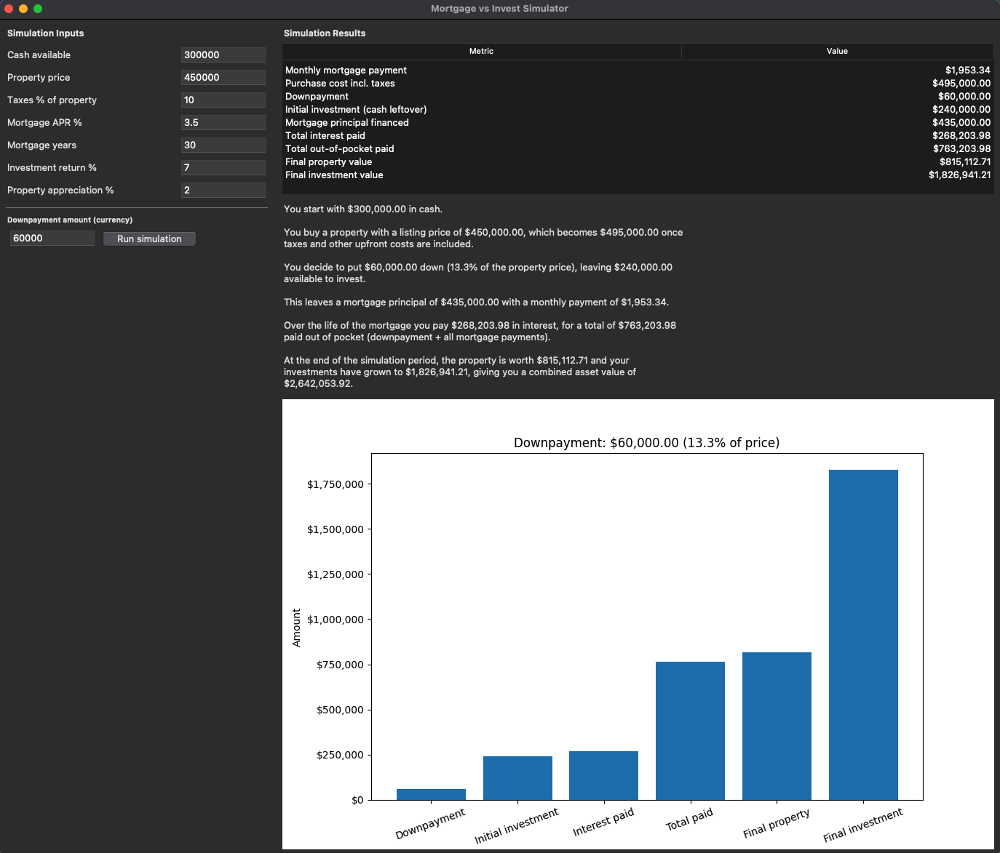

# Finantial Calculator FinCal

A simple utility to calculate your mortgage montly payments given the value of a property, the taxes and the downpayment.

## GUI

A beautiful GUI to calculate your mortgage



## Install from source using uv

```bash
rm -rf .venv
uv sync
```

and launch the guy

```bash
.venv/bin/mortgage-gui
```

## Install from source with pip

Clone this repository and create a new environment in the main directory

```bash
rm -rf .venv
python3 -m venv .venv
.venv/bin/python -m pip install --upgrade pip

# install package
.venv/bin/python -m pip install .
```

Launch the GUI

```bash
.venv/bin/mortgage-gui
```

## Install from wheel

```bash
rm -rf .venv
python3 -m venv .venv
.venv/bin/python -m pip install --upgrade pip

.venv/bin/python -m pip install "https://github.com/SebastiaAgramunt/fincal/releases/download/v0.0.1/fincal-0.1.0-py3-none-any.whl"

.venv/bin/mortgage-gui
```

## Push wheel

In master, tag the version and push

```bash
VERSION=0.0.1
git tag -a v${VERSION} -m "v${VERSION}"
git push origin v${VERSION}
```
